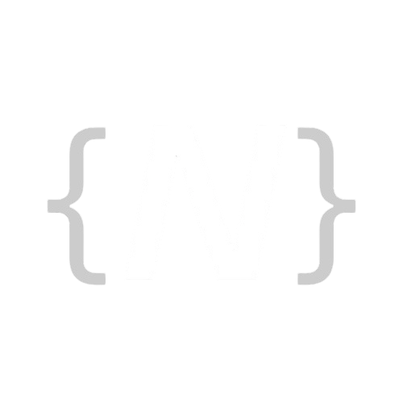

# Numen
A programming language built in Rust, designed for science and general-purpose use.
> ⚠️ Numen is currently in active development. Expect breaking changes.





## What is Numen?

Numen is a language that treats units as first-class citizens. Write code the way you think about physics and math — with units attached, not bolted on after the fact.

```numen
fixed body_kg =  10 as kg;
```


## TODO!
- [ X ] control flow
- [  ] unit casting
- [  ] std library
- [  ]  func calls
- [  ] io funcs

## Features

- unit casting using the as keyword  
- Built-in visualizer for math and more ..
- Built-in Emulator for physics and more ..
- simple syntax you can learn in a day
- more features will be added soon !.


## Usage/Examples

### > hello world in Numen

```numen
func main () {
    print "hello world";
}
```

### > loops

```numen
func main () {
    set i = 0;
    loop {
        i = i + 1;
        if i > 10 {
            stop;
        }
        if i == 1 or i == 3 or i == 5 or i == 7 or i == 9 {
            continue;
        }
        print i;
    }
}
```


## get started

using cargo and rust to build it !

```bash
  git clone https://github.com/mohammed-dev23/Numen.git
  cd Numen
  cargo run
```

NOTE : for now make sure to edit the main.rs to your numen.numn dir
    
## Contributing

Contributions are always welcome!
